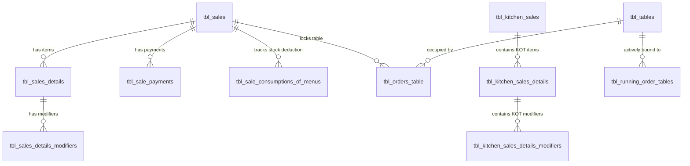
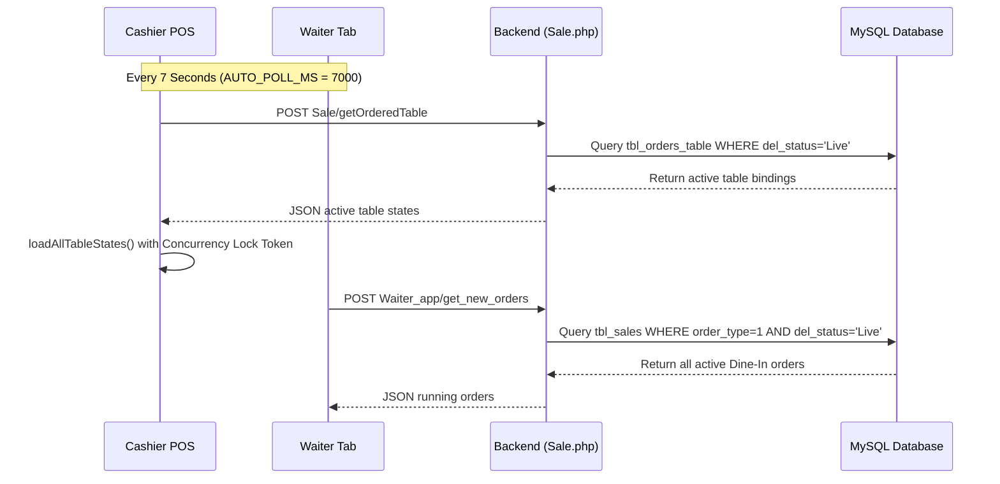
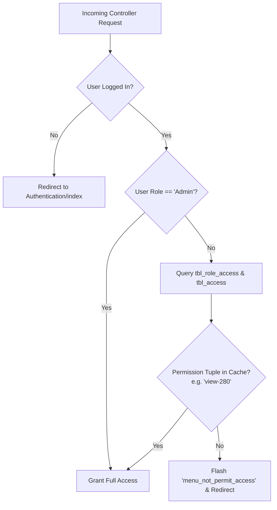

# Restaurant Management System — Comprehensive System Architecture & Codebase Map

> **Document Type:** Full Architectural Scan & Technical Reference  
> **Target System:** Restaurant Management & Point of Sale (POS) System  
> **Source Base:** `c:\laragon\www\daddys-test`  
> **Generated:** September 2026  
> **Verification Standard:** 100% evidence-based mapping from code, controllers, models, helpers, and assets with exact file paths and line numbers.

---

## Table of Contents
1. [System Overview](#1-system-overview)
   - [1.1 Framework & Core Stack](#11-framework--core-stack)
   - [1.2 High-Level Folder Structure](#12-high-level-folder-structure)
   - [1.3 Complete Controller Catalog (Categorized)](#13-complete-controller-catalog-categorized)
2. [Order Management Module](#2-order-management-module)
   - [2.1 Entry Points & Channels](#21-entry-points--channels)
   - [2.2 Database Schema & Table Relationships](#22-database-schema--table-relationships)
   - [2.3 Order Lifecycle & Status Field Specifications](#23-order-lifecycle--status-field-specifications)
   - [2.4 Table Synchronization & Auto-Polling Flow](#24-table-synchronization--auto-polling-flow)
   - [2.5 Order Modification, Splitting, Cancellation, & Deletion](#25-order-modification-splitting-cancellation--deletion)
   - [2.6 Recently Applied Fixes & Architectural Rationale](#26-recently-applied-fixes--architectural-rationale)
3. [Reports Module](#3-reports-module)
   - [3.1 Complete Inventory of Available Reports](#31-complete-inventory-of-available-reports)
   - [3.2 Data Sources, Supported Filters, & Integrity Rules](#32-data-sources-supported-filters--integrity-rules)
   - [3.3 Export Architectures & Implementation Methods](#33-export-architectures--implementation-methods)
4. [Inventory & Stock Management Module](#4-inventory--stock-management-module)
   - [4.1 Stock Tracking Mathematical Formula & Ingestion](#41-stock-tracking-mathematical-formula--ingestion)
   - [4.2 Auto-Deduction Lifecycle & Database Flow](#42-auto-deduction-lifecycle--database-flow)
   - [4.3 Low-Stock Alerts, Reorder Logic, & Batch Adjustments](#43-low-stock-alerts-reorder-logic--batch-adjustments)
5. [User, Staff, Roles, & Permissions Module](#5-user-staff-roles--permissions-module)
   - [5.1 User Roles & Operational Responsibilities](#51-user-roles--operational-responsibilities)
   - [5.2 Session Lifecycle & Access Control Engine (`checkAccess`)](#52-session-lifecycle--access-control-engine-checkaccess)
   - [5.3 Audit Logging System (`putAuditLog` / `tbl_audit_logs`)](#53-audit-logging-system-putauditlog--tbl_audit_logs)
6. [Table, Area, & Multi-Outlet Architecture](#6-table-area--multi-outlet-architecture)
   - [6.1 Table Configuration, Capacity, & Floor Sections](#61-table-configuration-capacity--floor-sections)
   - [6.2 Multi-Outlet Data Isolation Engine (`outlet_id` Scoping)](#62-multi-outlet-data-isolation-engine-outlet_id-scoping)
7. [System Settings & Configuration](#7-system-settings--configuration)
   - [7.1 Core Operational Configuration Matrix](#71-core-operational-configuration-matrix)
   - [7.2 Tax, Currency, & Business Rules Management](#72-tax-currency--business-rules-management)
   - [7.3 Receipt Layouts & Thermal Printer Profiles](#73-receipt-layouts--thermal-printer-profiles)
8. [External Integrations & Hardware Subsystems](#8-external-integrations--hardware-subsystems)
   - [8.1 Payment Gateway Processing (Stripe, PayPal, Razorpay)](#81-payment-gateway-processing-stripe-paypal-razorpay)
   - [8.2 SMS & Notification Dispatchers (Twilio, Nexmo, Textlocal)](#82-sms--notification-dispatchers-twilio-nexmo-textlocal)
   - [8.3 Hardware Printing Bridge (ESC/POS Print Server & COM2 VFD Pole Display)](#83-hardware-printing-bridge-escpos-print-server--com2-vfd-pole-display)
   - [8.4 Third-Party Delivery Integration & REST API Layer](#84-third-party-delivery-integration--rest-api-layer)
9. [Cross-Cutting Architectural Patterns & Risk Assessment](#9-cross-cutting-architectural-patterns--risk-assessment)
   - [9.1 Communication Paradigms: Polling vs. Real-Time WebSocket/SSE](#91-communication-paradigms-polling-vs-real-time-websocketsse)
   - [9.2 Soft-Delete Consistency (`del_status`) vs. Hard-Deletes](#92-soft-delete-consistency-del_status-vs-hard-deletes)
   - [9.3 Error Handling Discrepancies & Silent Failure Vulnerabilities](#93-error-handling-discrepancies--silent-failure-vulnerabilities)
   - [9.4 Pre-Insert Validation Weaknesses in Non-Order Modules](#94-pre-insert-validation-weaknesses-in-non-order-modules)

---

## 1. System Overview

### 1.1 Framework & Core Stack
- **Backend PHP Framework:** CodeIgniter **v3.1.6** ([`system/core/CodeIgniter.php:58`](file:///c:/laragon/www/daddys-test/system/core/CodeIgniter.php#L58)).
- **Architecture Pattern:** Classic Model-View-Controller (MVC) with custom procedural/static helper functions ([`application/helpers/my_helper.php`](file:///c:/laragon/www/daddys-test/application/helpers/my_helper.php)).
- **Database Layer:** MySQL / MariaDB using CodeIgniter Active Record Query Builder (`CI_DB_query_builder`).
- **Frontend Core:** Vanilla JavaScript, jQuery **v3.3.1** ([`frequent_changing/kitchen_panel/js/jquery-3.3.1.min.js`](file:///c:/laragon/www/daddys-test/frequent_changing/kitchen_panel/js/jquery-3.3.1.min.js)), jQuery UI ([`frequent_changing/js/jquery-ui.js`](file:///c:/laragon/www/daddys-test/frequent_changing/js/jquery-ui.js)).
- **Client-Side Storage:** Browser IndexedDB (database name: `irestora_plus`, version: `1`, object stores: `orders`, `order_tables`, `future_sales`, `recent_sales`) initialized in [`frequent_changing/js/pos_script_v7.1.1.js:217`](file:///c:/laragon/www/daddys-test/frequent_changing/js/pos_script_v7.1.1.js#L217).
- **UI Components & Tooling:** Bootstrap (v3/v4), DataTables with HTML5 Export plugins (JSZip, pdfmake) in [`frequent_changing/js/custom_report.js:26-60`](file:///c:/laragon/www/daddys-test/frequent_changing/js/custom_report.js#L26-L60), SweetAlert2 ([`frequent_changing/waiter_panel/js/sweetalert2.all.min.js`](file:///c:/laragon/www/daddys-test/frequent_changing/waiter_panel/js/sweetalert2.all.min.js)), Select2, Toastr, FontAwesome v5.4.2.
- **Third-Party PHP Libraries:** Endroid QR Code ([`application/controllers/Setting.php:19-25`](file:///c:/laragon/www/daddys-test/application/controllers/Setting.php#L19-L25)), PHPExcel (`application/third_party/PHPExcel/`), Escpos-PHP (`print_server/`), Twilio SDK (`Twilio/`), REST_Controller (`application/libraries/REST_Controller.php`).

### 1.2 High-Level Folder Structure
- **[`application/controllers/`](file:///c:/laragon/www/daddys-test/application/controllers/)**: Contains 56 application controllers handling HTTP routing, AJAX endpoints, view rendering, and form actions.
- **[`application/models/`](file:///c:/laragon/www/daddys-test/application/models/)**: Contains 29 model classes encapsulating SQL business logic, report aggregations, inventory equations, and authentication lookups.
- **[`application/views/`](file:///c:/laragon/www/daddys-test/application/views/)**: Presentation layer containing POS UI, Kitchen Display screens, Waiter Tab panels, customer display view, reports, and administrative management tables.
- **[`application/helpers/`](file:///c:/laragon/www/daddys-test/application/helpers/)**: Core system helpers including [`my_helper.php`](file:///c:/laragon/www/daddys-test/application/helpers/my_helper.php) which defines permission checks, audit logging, tax calculation routines, currency formatting, and table state resolution.
- **[`frequent_changing/js/`](file:///c:/laragon/www/daddys-test/frequent_changing/js/)**: Main JavaScript runtime for POS business logic ([`pos_script_v7.1.1.js`](file:///c:/laragon/www/daddys-test/frequent_changing/js/pos_script_v7.1.1.js)), AJAX form handling, dynamic table manipulations, and client-side calculations.
- **[`frequent_changing/kitchen_panel/`](file:///c:/laragon/www/daddys-test/frequent_changing/kitchen_panel/)** & **[`frequent_changing/waiter_panel/`](file:///c:/laragon/www/daddys-test/frequent_changing/waiter_panel/)**: Specialized JavaScript panels for real-time kitchen item status tracking and waiter order notification workflows.
- **[`print_server/`](file:///c:/laragon/www/daddys-test/print_server/)**: Standalone local micro-server for hardware integration (ESC/POS thermal printers via Windows shared printer names, local IP auto-discovery via `get_ip.php`, and VFD Customer Pole Display COM port streaming via `vfd_update.php`).
- **[`assets/`](file:///c:/laragon/www/daddys-test/assets/)**: Vendor libraries, styles, icon sets, static images, and temporary cache JSON files.

### 1.3 Complete Controller Catalog (Categorized)

| Module Group | Controller File | Purpose & Responsibilities |
| :--- | :--- | :--- |
| **Order & POS** | [`Sale.php`](file:///c:/laragon/www/daddys-test/application/controllers/Sale.php) | Primary POS terminal controller; order entry, KOT submission, bill settlement, split billing, customer display feed, table states, online push. |
| | [`Order.php`](file:///c:/laragon/www/daddys-test/application/controllers/Order.php) | Online, QR-code self-ordering, and delivery order collection management. |
| | [`POSChecker.php`](file:///c:/laragon/www/daddys-test/application/controllers/POSChecker.php) | Order verification terminal for kitchen checker/dispatcher before serving. |
| | [`Kitchen.php`](file:///c:/laragon/www/daddys-test/application/controllers/Kitchen.php) | Kitchen Display System (KDS); cook/ready status updates, item routing per kitchen station. |
| | [`Waiter.php`](file:///c:/laragon/www/daddys-test/application/controllers/Waiter.php) | Web-based Waiter interface for order notifications, status alerts, and table assignment. |
| | [`Waiter_app.php`](file:///c:/laragon/www/daddys-test/application/controllers/Waiter_app.php) | Dedicated backend API and view endpoints for tablet Waiter application. |
| | [`Register.php`](file:///c:/laragon/www/daddys-test/application/controllers/Register.php) | Cash drawer register operations; opening register balance, closing register reconciliation. |
| | [`Denomination.php`](file:///c:/laragon/www/daddys-test/application/controllers/Denomination.php) | Cash denomination setup for accurate register closing cash counts. |
| **Reports** | [`Report.php`](file:///c:/laragon/www/daddys-test/application/controllers/Report.php) | Comprehensive reporting engine containing 36 operational, financial, inventory, and performance reports. |
| **Inventory & Stock** | [`Inventory.php`](file:///c:/laragon/www/daddys-test/application/controllers/Inventory.php) | Real-time ingredient stock queries and alert quantity monitoring. |
| | [`Inventory_adjustment.php`](file:///c:/laragon/www/daddys-test/application/controllers/Inventory_adjustment.php) | Manual stock adjustment entry (damage, loss, physical count reconciliation). |
| | [`Purchase.php`](file:///c:/laragon/www/daddys-test/application/controllers/Purchase.php) | Purchase orders, supplier invoice logging, and raw ingredient intake. |
| | [`Supplier.php`](file:///c:/laragon/www/daddys-test/application/controllers/Supplier.php) | Supplier contact directory and credit profile management. |
| | [`SupplierPayment.php`](file:///c:/laragon/www/daddys-test/application/controllers/SupplierPayment.php) | Accounts payable settlement and supplier ledger payment entries. |
| | [`Waste.php`](file:///c:/laragon/www/daddys-test/application/controllers/Waste.php) | Waste tracking for damaged raw ingredients and spoiled food items. |
| | [`Production.php`](file:///c:/laragon/www/daddys-test/application/controllers/Production.php) | Batch recipe production and conversion of raw ingredients to finished stock. |
| | [`PreMadeFood.php`](file:///c:/laragon/www/daddys-test/application/controllers/PreMadeFood.php) | Semi-finished food items and intermediate recipe management. |
| | [`Transfer.php`](file:///c:/laragon/www/daddys-test/application/controllers/Transfer.php) | Inter-outlet inventory transfers (dispatch and receipt tracking). |
| **Menu & Recipe** | [`FoodMenu.php`](file:///c:/laragon/www/daddys-test/application/controllers/FoodMenu.php) | Menu items, recipes, ingredient consumption ratios, modifier assignment, barcodes. |
| | [`FoodMenuCategory.php`](file:///c:/laragon/www/daddys-test/application/controllers/FoodMenuCategory.php) | Menu item classification and category sorting. |
| | [`Modifier.php`](file:///c:/laragon/www/daddys-test/application/controllers/Modifier.php) | Add-on modifiers (e.g. extra cheese, cooking preference) and ingredient consumption rules. |
| | [`Ingredient.php`](file:///c:/laragon/www/daddys-test/application/controllers/Ingredient.php) | Raw materials directory, default purchase prices, unit mappings, alert thresholds. |
| | [`IngredientCategory.php`](file:///c:/laragon/www/daddys-test/application/controllers/IngredientCategory.php) | Ingredient categorization. |
| | [`Unit.php`](file:///c:/laragon/www/daddys-test/application/controllers/Unit.php) | Unit of measurement definitions (kg, g, l, ml, pcs) and conversion coefficients. |
| **User, Staff & HR** | [`User.php`](file:///c:/laragon/www/daddys-test/application/controllers/User.php) | System users (cashiers, waiters, kitchen staff, managers) and outlet permissions. |
| | [`Role.php`](file:///c:/laragon/www/daddys-test/application/controllers/Role.php) | Role definitions and granular permission mapping matrix. |
| | [`Attendance.php`](file:///c:/laragon/www/daddys-test/application/controllers/Attendance.php) | Staff clock-in / clock-out tracking and attendance logging. |
| | [`Authentication.php`](file:///c:/laragon/www/daddys-test/application/controllers/Authentication.php) | Central auth controller: login, logout, password recovery, profile settings, auto-IP configuration. |
| | [`Login.php`](file:///c:/laragon/www/daddys-test/application/controllers/Login.php) | Alternate/legacy authentication endpoint. |
| **Customer & CRM** | [`Customer.php`](file:///c:/laragon/www/daddys-test/application/controllers/Customer.php) | Customer database, delivery addresses, credit balance, and loyalty points. |
| | [`Customer_due_receive.php`](file:///c:/laragon/www/daddys-test/application/controllers/Customer_due_receive.php) | Outstanding customer credit collection and due payment logging. |
| | [`DeliveryPartner.php`](file:///c:/laragon/www/daddys-test/application/controllers/DeliveryPartner.php) | Third-party delivery channel management (PickMe, UberEats) and commission rules. |
| | [`Promotion.php`](file:///c:/laragon/www/daddys-test/application/controllers/Promotion.php) | Promotional campaigns, buy-one-get-one, time-based discount rules. |
| **Table & Space** | [`Table.php`](file:///c:/laragon/www/daddys-test/application/controllers/Table.php) | Dining tables CRUD, seating capacity, layout ordering. |
| | [`Area.php`](file:///c:/laragon/www/daddys-test/application/controllers/Area.php) | Dining sections and floor zones (Main Hall, AC Room, Terrace). |
| **Settings & Admin** | [`Setting.php`](file:///c:/laragon/www/daddys-test/application/controllers/Setting.php) | Core system configuration (taxes, invoices, print routing, self-order QR). |
| | [`Outlet.php`](file:///c:/laragon/www/daddys-test/application/controllers/Outlet.php) | Multi-outlet profiles, business hours, outlet switcher. |
| | [`PaymentMethod.php`](file:///c:/laragon/www/daddys-test/application/controllers/PaymentMethod.php) | Payment method master (Cash, Card, Digital Wallets, Cheque). |
| | [`MultipleCurrency.php`](file:///c:/laragon/www/daddys-test/application/controllers/MultipleCurrency.php) | Multi-currency exchange rate conversions. |
| | [`Expense.php`](file:///c:/laragon/www/daddys-test/application/controllers/Expense.php) | Operational expense logging (petty cash, utilities, supplies). |
| | [`ExpenseItems.php`](file:///c:/laragon/www/daddys-test/application/controllers/ExpenseItems.php) | Expense categories master. |
| | [`WhiteLabel.php`](file:///c:/laragon/www/daddys-test/application/controllers/WhiteLabel.php) | System white-labeling, brand name, logo, custom footer credits. |
| | [`Printer.php`](file:///c:/laragon/www/daddys-test/application/controllers/Printer.php) | Physical printer hardware configuration and port/IP bindings. |
| | [`Print_api.php`](file:///c:/laragon/www/daddys-test/application/controllers/Print_api.php) | API endpoint for communicating with local print daemon. |
| | [`IR_api.php`](file:///c:/laragon/www/daddys-test/application/controllers/IR_api.php) | REST API endpoints for external integrations. |
| | [`Service.php`](file:///c:/laragon/www/daddys-test/application/controllers/Service.php) | Background system utilities, maintenance tasks, and license verification. |
| | [`Update.php`](file:///c:/laragon/www/daddys-test/application/controllers/Update.php) | System updates, migration execution, license verification. |
| | [`Short_message_service.php`](file:///c:/laragon/www/daddys-test/application/controllers/Short_message_service.php) | SMS gateway dispatcher (Twilio, Nexmo, Textlocal). |
| | [`PaymentController.php`](file:///c:/laragon/www/daddys-test/application/controllers/PaymentController.php) | Payment gateway webhook and checkout processor (Stripe, PayPal). |
| | [`Excelimport.php`](file:///c:/laragon/www/daddys-test/application/controllers/Excelimport.php) | Bulk Excel/CSV data importer for menus, ingredients, and customers. |
| | [`Dashboard.php`](file:///c:/laragon/www/daddys-test/application/controllers/Dashboard.php) | Business analytics dashboard, financial summaries, sales graphs. |
| | [`Master.php`](file:///c:/laragon/www/daddys-test/application/controllers/Master.php) | Generic master data utilities and helpers. |
| | [`Plugin.php`](file:///c:/laragon/www/daddys-test/application/controllers/Plugin.php) | Modular plugin and extension loader. |

---

## 2. Order Management Module

### 2.1 Entry Points & Channels
1. **Cashier POS Terminal (`Sale/POS`):** Accessible at [`application/controllers/Sale.php:400`](file:///c:/laragon/www/daddys-test/application/controllers/Sale.php#L400). Supports Dine-In (`order_type = 1`), Take Away (`order_type = 2`), and Delivery (`order_type = 3`).
2. **Waiter Tablet App (`Waiter_app/POS`):** Accessible at [`application/controllers/Waiter_app.php:102`](file:///c:/laragon/www/daddys-test/application/controllers/Waiter_app.php#L102). Dedicated lightweight mobile/tablet ordering terminal.
3. **Self-Order & Online QR Channel (`Order/order_details`):** Scoped in [`application/controllers/Order.php:20`](file:///c:/laragon/www/daddys-test/application/controllers/Order.php#L20) and configured via QR generation in [`application/controllers/Setting.php:51`](file:///c:/laragon/www/daddys-test/application/controllers/Setting.php#L51).

### 2.2 Database Schema & Table Relationships



- **`tbl_sales`**: Master sales ledger containing header information (`id`, `sale_no`, `order_type`, `order_status`, `customer_id`, `total_items`, `sub_total`, `vat`, `total_payable`, `paid_amount`, `due_amount`, `waiter_id`, `user_id`, `outlet_id`, `company_id`, `del_status`).
- **`tbl_sales_details`**: Line items for sales (`id`, `food_menu_id`, `qty`, `menu_price_without_discount`, `menu_unit_price`, `menu_discount_value`, `discount_amount`, `sales_id`, `outlet_id`, `del_status`).
- **`tbl_sales_details_modifiers`**: Item modifiers tied to sale details (`id`, `modifier_id`, `modifier_price`, `food_menu_id`, `sales_id`, `sales_details_id`, `outlet_id`, `del_status`).
- **`tbl_kitchen_sales`**: Active kitchen orders / KOT records ([`Sale.php:1347`](file:///c:/laragon/www/daddys-test/application/controllers/Sale.php#L1347)). Stores unfinalized and in-progress kitchen orders.
- **`tbl_kitchen_sales_details`**: Individual items sent to kitchen stations with cooking state (`cooking_status`, `cooking_start_time`, `cooking_done_time`).
- **`tbl_orders_table`**: Active table bookings tied to running orders (`id`, `persons`, `booking_time`, `sale_id`, `sale_no`, `outlet_id`, `table_id`, `del_status`).
- **`tbl_running_order_tables`**: Secondary fast-lookup cache for running tables.
- **`tbl_sale_payments`**: Split payment breakdown per transaction (`payment_id`, `payment_name`, `amount`, `sale_id`, `outlet_id`).
- **`tbl_notifications`**: Real-time alerts for kitchen and waiter terminals (`notification`, `sale_id`, `waiter_id`, `outlet_id`).

### 2.3 Order Lifecycle & Status Field Specifications

#### `tbl_sales.order_status` Values:
- **`1` = In Progress / Running Order:** Active order placed on a table or in kitchen, not yet billed.
- **`2` = Billed / Partial / Awaiting Payment:** Final bill generated, customer paying or due amount remaining.
- **`3` = Finalized / Closed / Invoiced:** Fully paid and completed order. This is the **only** status counted in financial sales reports ([`Sale.php:3550-3553`](file:///c:/laragon/www/daddys-test/application/controllers/Sale.php#L3550-L3553), [`Report_model.php:48`](file:///c:/laragon/www/daddys-test/application/models/Report_model.php#L48)).

#### `tbl_kitchen_sales_details.cooking_status` Values:
- **`"Started Cooking"` / `1`**: Dish accepted by kitchen cook.
- **`"Done"` / `2`**: Dish finished cooking and ready for pickup.
- **`"Unready"` / `3`**: In queue awaiting preparation.

#### `tbl_sales.del_status` Values:
- **`"Live"`**: Valid active record.
- **`"Deleted"`**: Soft-deleted record excluded from all operations and reports.

### 2.4 Table Synchronization & Auto-Polling Flow
The system operates purely via HTTP AJAX polling across all client terminals:



- **POS Polling Engine:** Defined in [`frequent_changing/js/pos_script_v7.1.1.js:22723`](file:///c:/laragon/www/daddys-test/frequent_changing/js/pos_script_v7.1.1.js#L22723) with `AUTO_POLL_MS = 7000` (7 seconds). Triggers `displayServerOrders()` and `loadAllTableStates()`.
- **Kitchen & Waiter Polling:** Defined in [`frequent_changing/kitchen_panel/js/custom.js:1052`](file:///c:/laragon/www/daddys-test/frequent_changing/kitchen_panel/js/custom.js#L1052) and [`frequent_changing/waiter_panel/js/custom.js:433`](file:///c:/laragon/www/daddys-test/frequent_changing/waiter_panel/js/custom.js#L433) running on a **15-second interval** (`15000ms`) for notifications and orders, plus a 1-second interval (`1000ms`) for elapsed cooking timers.

### 2.5 Order Modification, Splitting, Cancellation, & Deletion
- **Order Modification (`Sale/add_kitchen_sale_by_ajax`):** When modifying an existing order (`sale_id > 0`), the system updates `tbl_kitchen_sales` ([`Sale.php:1342`](file:///c:/laragon/www/daddys-test/application/controllers/Sale.php#L1342)), updates existing `tbl_sales` row ([`Sale.php:1322`](file:///c:/laragon/www/daddys-test/application/controllers/Sale.php#L1322)), and deletes old child rows from `tbl_sales_details`, `tbl_sales_details_modifiers`, and `tbl_sale_consumptions` before re-inserting fresh item rows.
- **Split Billing (`Sale/add_sale_by_ajax_split`):** Implemented at [`Sale.php:1897`](file:///c:/laragon/www/daddys-test/application/controllers/Sale.php#L1897). Creates separate child sales entries with fractional quantities and settles each sub-bill independently.
- **Order Settlement / Finalize (`Sale/update_order_status_ajax`):** Sets `order_status = 3`, records payment methods in `tbl_sale_payments`, and purges active table records from `tbl_orders_table` and `tbl_running_order_tables` ([`Sale.php:3530-3548`](file:///c:/laragon/www/daddys-test/application/controllers/Sale.php#L3530-L3548)).
- **Order Cancellation & Audit (`Sale/add_cancel_audit_report`):** Located at [`Sale.php:1832-1895`](file:///c:/laragon/www/daddys-test/application/controllers/Sale.php#L1832-L1895). Cancels the order, removes kitchen rows from `tbl_kitchen_sales`, compiles the order summary and cancellation reason into text, and writes an audit record via `putAuditLog()` ([`my_helper.php:581`](file:///c:/laragon/www/daddys-test/application/helpers/my_helper.php#L581)).
- **Sale Soft-Delete (`Sale/deleteSale`):** Located at [`Sale.php:360`](file:///c:/laragon/www/daddys-test/application/controllers/Sale.php#L360). Marks `del_status = 'Deleted'` on `tbl_sales` and cleans up associated table occupancy.

### 2.6 Recently Applied Fixes & Architectural Rationale
1. **Cashier / Waiter Order View Alignment ([`Sale_model.php:375-382`](file:///c:/laragon/www/daddys-test/application/models/Sale_model.php#L375-L382)):**
   - *Issue:* Non-Admin cashiers were isolated from seeing dine-in orders placed by waiters due to strict `user_id` ownership filtering.
   - *Fix:* Replaced filter with `(tbl_sales.order_type = 1 OR tbl_sales.user_id = user_id)`, ensuring all dine-in table states are universally visible across all cashier and waiter terminals.
2. **Fail-Closed Duplicate Order Safeguard ([`Sale.php:1386-1439`](file:///c:/laragon/www/daddys-test/application/controllers/Sale.php#L1386-L1439)):**
   - *Issue:* High-concurrency submissions from multiple terminals could double-book the same table.
   - *Fix:* Added two-pass validation inside a transaction (`$this->db->trans_begin()`). Pass 1 executes an atomic SQL query checking if any selected table is occupied by another live, non-closed order (`order_status != 3`). If occupied or if the DB check fails, the transaction rolls back with a clear error.
3. **IndexedDB KeyPath Alignment & Cleanup ([`pos_script_v7.1.1.js:1017-1219`](file:///c:/laragon/www/daddys-test/frequent_changing/js/pos_script_v7.1.1.js#L1017-L1219)):**
   - *Issue:* `sale_id` vs `sales_id` keyPath naming discrepancy caused duplicate table rows in browser storage.
   - *Fix:* Unified keyPath to `sales_id`, added automatic purging of stale legacy records in IndexedDB cursor loops, and introduced a sequential concurrency token (`currentTableLoadToken`) to discard out-of-order AJAX callbacks.
4. **Auto-Poll Timer Optimization ([`pos_script_v7.1.1.js:22723`](file:///c:/laragon/www/daddys-test/frequent_changing/js/pos_script_v7.1.1.js#L22723)):**
   - *Issue:* 12-second polling window was too wide for fast-paced table turns.
   - *Fix:* Reduced interval to 7 seconds (`AUTO_POLL_MS = 7000`) with `_autoPollBusy` and `document.hidden` guards to prevent network pileups.

---

## 3. Reports Module

### 3.1 Complete Inventory of Available Reports
The system features **36 distinct reports** implemented across [`application/controllers/Report.php`](file:///c:/laragon/www/daddys-test/application/controllers/Report.php) and [`application/models/Report_model.php`](file:///c:/laragon/www/daddys-test/application/models/Report_model.php):

```
 1. printDailySummaryReport       [Report.php:154]
 2. dailySummaryReport            [Report.php:168]
 3. zReport (Z-Report)            [Report.php:194]
 4. registerReport                [Report.php:251]
 5. todayReport                   [Report.php:287]
 6. todayReportCashStatus         [Report.php:298]
 7. inventoryReport               [Report.php:307]
 8. saleReportByMonth             [Report.php:336]
 9. vatReport                     [Report.php:388]
10. tipsReport                    [Report.php:412]
11. saleReportByDate              [Report.php:439]
12. profitLossReport              [Report.php:466]
13. profitLossReportBackup        [Report.php:485]
14. supplierLedgerReport          [Report.php:512]
15. customerLedgerReport          [Report.php:618]
16. availableLoyaltyPointReport   [Report.php:718]
17. usageLoyaltyPointReport       [Report.php:740]
18. foodMenuSales                 [Report.php:782]
19. foodMenuSaleByCategories      [Report.php:811]
20. productAnalysisReport         [Report.php:833]
21. foodMenuSaleDetailsByCategories [Report.php:892]
22. consumptionReport             [Report.php:920]
23. detailedSaleReport            [Report.php:946]
24. purchaseReportByMonth         [Report.php:975]
25. purchaseReportByDate          [Report.php:1027]
26. purchaseReportByIngredient    [Report.php:1050]
27. detailedPurchaseReport        [Report.php:1072]
28. wasteReport                   [Report.php:1094]
29. expenseReport                 [Report.php:1121]
30. kitchenPerformanceReport     [Report.php:1148]
31. supplierDueReport             [Report.php:1172]
32. customerDueReport             [Report.php:1189]
33. getInventoryAlertList         [Report.php:1206]
34. attendanceReport              [Report.php:1218]
35. auditLogReport                [Report.php:1235]
36. transferReport                [Report.php:1276]
```

### 3.2 Data Sources, Supported Filters, & Integrity Rules

| Report Name | Primary Tables Queried | Supported Filters | Status / Soft-Delete Enforcement |
| :--- | :--- | :--- | :--- |
| **Daily Summary / Z-Report** | `tbl_sales`, `tbl_sale_payments`, `tbl_expenses`, `tbl_customer_due_receives`, `tbl_supplier_payments` | Date, Outlet | `order_status = 3`, `del_status = 'Live'` ([`Report_model.php:48, 138`](file:///c:/laragon/www/daddys-test/application/models/Report_model.php#L48)) |
| **Detailed Sale Report** | `tbl_sales`, `tbl_sales_details`, `tbl_customers`, `tbl_users` | Start Date, End Date, User/Staff, Customer, Outlet | `order_status = 3`, `del_status = 'Live'` ([`Report_model.php:1032, 1075`](file:///c:/laragon/www/daddys-test/application/models/Report_model.php#L1032)) |
| **Consumption Report** | `tbl_sale_consumptions_of_menus`, `tbl_sale_consumptions_of_modifiers_of_menus`, `tbl_ingredients` | Date Range, Outlet | `del_status = 'Live'`, linked strictly to finalized sales |
| **Profit / Loss Report** | `tbl_sales`, `tbl_sale_consumptions_of_menus`, `tbl_expenses`, `tbl_wastes` | Start Date, End Date, Outlet | Gross sales (`order_status = 3`) minus COGS (consumption), operational expenses, and waste |
| **Inventory Stock Report** | `tbl_ingredients`, `tbl_purchase_ingredients`, `tbl_sale_consumptions_of_menus`, `tbl_waste_ingredients`, `tbl_transfers`, `tbl_inventory_adjustment_ingredients` | Category, Ingredient, Food Menu, Outlet | `del_status = 'Live'` across all operational tables ([`Inventory_model.php:67-92`](file:///c:/laragon/www/daddys-test/application/models/Inventory_model.php#L67-L92)) |
| **Staff / Kitchen Performance** | `tbl_kitchen_sales_details`, `tbl_sales`, `tbl_users` | Date Range, Kitchen Station, Waiter, Outlet | `del_status = 'Live'` |
| **Audit Log Report** | `tbl_audit_logs`, `tbl_users` | Date Range, User, Event Type, Outlet | Scoped to active outlet ([`Report.php:1235-1275`](file:///c:/laragon/www/daddys-test/application/controllers/Report.php#L1235-L1275)) |

> [!IMPORTANT]
> **Financial Data Integrity:** Verification of `Report_model.php` (lines 48, 138, 237, 279, 370, 392, 512, 1032, 1075, 1185, 1407, 1946, 2150, 2217) proves that **every financial report strictly enforces `order_status = 3` and `del_status = 'Live'`**. In-progress orders (`status = 1`), unpaid bills (`status = 2`), cancelled orders, and soft-deleted records are completely excluded from sales totals and revenue metrics.

### 3.3 Export Architectures & Implementation Methods
1. **Interactive DataTables HTML5 Client-Side Export:**
   Configured in [`frequent_changing/js/custom_report.js:32-65`](file:///c:/laragon/www/daddys-test/frequent_changing/js/custom_report.js#L32-L65). Provides instant browser-side generation:
   - **Excel Export:** `excelHtml5` via `JSZip`.
   - **PDF Export:** `pdfHtml5` via `pdfmake`.
   - **CSV Export:** `csvHtml5`.
   - **Clipboard Copy:** `copyHtml5`.
   - **Browser Print:** Custom formatted print window.
2. **Server-Side PHP Spreadsheet Generation:**
   Backend Excel downloads generated using PHPExcel library located in `application/third_party/PHPExcel/`.
3. **Thermal POS Summary Printing:**
   Formatted 80mm/56mm thermal receipts for Z-Report and Daily Summaries rendered directly to local thermal printers via ESC/POS bridge ([`Report.php:154`](file:///c:/laragon/www/daddys-test/application/controllers/Report.php#L154)).

---

## 4. Inventory & Stock Management Module

### 4.1 Stock Tracking Mathematical Formula & Ingestion
The system calculates real-time ingredient stock using an SQL aggregation formula located in [`application/models/Inventory_model.php:67-92`](file:///c:/laragon/www/daddys-test/application/models/Inventory_model.php#L67-L92):

$$\text{Current Stock} = \text{Purchases} - \text{Menu Consumption} - \text{Modifier Consumption} - \text{Waste} + \text{Adj}_{+} - \text{Adj}_{-} + \text{Production} + \text{Transfers In} - \text{Transfers Out}$$

Where:
- **`Purchases`**: $\sum(\text{quantity\_amount})$ from `tbl_purchase_ingredients` where `del_status = 'Live'`.
- **`Menu Consumption`**: $\sum(\text{consumption})$ from `tbl_sale_consumptions_of_menus` where `del_status = 'Live'`.
- **`Modifier Consumption`**: $\sum(\text{consumption})$ from `tbl_sale_consumptions_of_modifiers_of_menus` where `del_status = 'Live'`.
- **`Waste`**: $\sum(\text{waste\_amount})$ from `tbl_waste_ingredients` where `del_status = 'Live'`.
- **`Adj_+` / `Adj_-`**: $\sum(\text{consumption\_amount})$ from `tbl_inventory_adjustment_ingredients` grouped by `consumption_status = 'Plus'` or `'Minus'`.
- **`Production`**: $\sum(\text{quantity\_amount})$ from `tbl_production_ingredients` where `status = 1`.
- **`Transfers In/Out`**: $\sum(\text{quantity\_amount})$ from `tbl_transfer_ingredients` / `tbl_transfer_received_ingredients` where `status = 1`.

### 4.2 Auto-Deduction Lifecycle & Database Flow
- **Recipe Linking:** When food items and modifiers are configured in `FoodMenu.php` and `Modifier.php`, ingredient consumption ratios are defined in `tbl_food_menus_ingredients` and `tbl_modifier_ingredients`.
- **Deduction Trigger:** When an order is pushed or closed in [`Sale.php:2278-2433`](file:///c:/laragon/www/daddys-test/application/controllers/Sale.php#L2278-L2433), the system calculates total raw ingredient quantities required by multiplying item order quantities by recipe ratios and writes records directly into `tbl_sale_consumptions_of_menus` and `tbl_sale_consumptions_of_modifiers_of_menus`.
- **Optimization Guard:** For already-synced closed orders (`status = 3`), re-calculating consumption queries is skipped to avoid redundant query overhead ([`Sale.php:2278`](file:///c:/laragon/www/daddys-test/application/controllers/Sale.php#L2278)).

### 4.3 Low-Stock Alerts, Reorder Logic, & Batch Adjustments
- **Alert Trigger:** Each ingredient defines an `alert_quantity` threshold in `tbl_ingredients`.
- **Alert Query:** [`Report.php:1206`](file:///c:/laragon/www/daddys-test/application/controllers/Report.php#L1206) (`getInventoryAlertList`) queries all ingredients where $\text{Current Stock} \le \text{alert\_quantity}$ and displays live warning badges on the Admin/Manager Dashboard ([`application/controllers/Dashboard.php`](file:///c:/laragon/www/daddys-test/application/controllers/Dashboard.php)).
- **Stock Audit Reconciliation:** Physical stock takes are logged through [`Inventory_adjustment.php`](file:///c:/laragon/www/daddys-test/application/controllers/Inventory_adjustment.php), which writes balancing entries with `Plus` or `Minus` adjustments without altering historical purchase or sales ledger records.

---

## 5. User, Staff, Roles, & Permissions Module

### 5.1 User Roles & Operational Responsibilities
The system supports multiple standard user roles configured in `tbl_roles`:
1. **Admin / Super Admin:** Full unrestricted system access; bypasses all permission validation checks ([`my_helper.php:2988`](file:///c:/laragon/www/daddys-test/application/helpers/my_helper.php#L2988)).
2. **POS User / Cashier:** Standard checkout terminal operations, bill printing, and order settlement.
3. **Waiter User:** Table order entry, KOT submission, waiter notification panel.
4. **Kitchen User:** KDS order display, dish preparation marking (`cooking_status`).
5. **Manager / Custom Role:** Granularly scoped access to reports, inventory, expenses, or settings.

### 5.2 Session Lifecycle & Access Control Engine (`checkAccess`)
Access control is implemented via a central helper function: [`checkAccess($controller, $function)`](file:///c:/laragon/www/daddys-test/application/helpers/my_helper.php#L2962):



- **Permission Matrix Tables:**
  - `tbl_roles`: Role definitions (`id`, `role_name`, `company_id`, `del_status`).
  - `tbl_access`: Master feature nodes with permission IDs (`id`, `main_module_id`, `function_name`, `parent_id`). E.g., `280` = Tables, `285` = Roles, `67` = Outlets, `6` = Settings, `350` = Data Reset.
  - `tbl_role_access`: Join table linking `role_id` to specific `access_child_id` permissions.
- **Permission Caching:** Permissions are loaded upon login into session array `$_SESSION['function_access']` ([`my_helper.php:3005`](file:///c:/laragon/www/daddys-test/application/helpers/my_helper.php#L3005)) and cached statically in PHP request memory to avoid database overhead.

### 5.3 Audit Logging System (`putAuditLog` / `tbl_audit_logs`)
- **Engine Function:** [`putAuditLog($user_id, $txt, $event, $date_time)`](file:///c:/laragon/www/daddys-test/application/helpers/my_helper.php#L581).
- **Target Schema (`tbl_audit_logs`):**
  - `id`: Primary key.
  - `user_id`: ID of the authenticated user performing the action.
  - `event_title`: Categorical action name (e.g. `"Cancelled Sale"`, `"Opening Register"`, `"Close Register"`, `"Delete Sale"`).
  - `date_time`: Full timestamp of execution.
  - `date`: Date partition (`Y-m-d`).
  - `outlet_id`: Scoped outlet.
  - `details`: Complete textual snapshot (item quantities, prices, discounts, and cancellation reasons) ([`Sale.php:1845-1895`](file:///c:/laragon/www/daddys-test/application/controllers/Sale.php#L1845-L1895)).

---

## 6. Table, Area, & Multi-Outlet Architecture

### 6.1 Table Configuration, Capacity, & Floor Sections
- **Areas / Sections ([`application/controllers/Area.php`](file:///c:/laragon/www/daddys-test/application/controllers/Area.php)):** Configured in `tbl_areas` (`id`, `area_name`, `description`, `outlet_id`, `company_id`, `del_status`). Allows grouping tables by physical location (e.g. Ground Floor, AC Hall, Garden Terrace).
- **Tables ([`application/controllers/Table.php`](file:///c:/laragon/www/daddys-test/application/controllers/Table.php)):** Configured in `tbl_tables` (`id`, `name`, `sit_capacity`, `position`, `outlet_id`, `company_id`, `area_id`, `del_status`).
- **Real-Time Seating Occupancy:** Computed dynamically on POS/Tab screens by checking active records in `tbl_orders_table` joined with `tbl_sales` where `order_status != 3` and `del_status = 'Live'`.

### 6.2 Multi-Outlet Data Isolation Engine (`outlet_id` Scoping)
The application is architected for multi-branch / multi-outlet chains operating under a parent `company_id`:
- **Outlet Selection:** Managed via [`application/controllers/Outlet.php`](file:///c:/laragon/www/daddys-test/application/controllers/Outlet.php). When entering an outlet, `$this->session->set_userdata('outlet_id', $outlet_id)` is established.
- **Universal Query Scoping:** Every operational database transaction across all modules explicitly injects `outlet_id`:
  - Sales & Orders: `WHERE outlet_id = $outlet_id AND del_status = 'Live'` ([`Sale_model.php:27`](file:///c:/laragon/www/daddys-test/application/models/Sale_model.php#L27)).
  - Kitchen & KOT: `WHERE outlet_id = $outlet_id` ([`Sale.php:1269`](file:///c:/laragon/www/daddys-test/application/controllers/Sale.php#L1269)).
  - Table Bookings: `WHERE outlet_id = $outlet_id` ([`Sale.php:1398`](file:///c:/laragon/www/daddys-test/application/controllers/Sale.php#L1398)).
  - Purchases & Stock: `WHERE outlet_id = $outlet_id` ([`Inventory_model.php:67-92`](file:///c:/laragon/www/daddys-test/application/models/Inventory_model.php#L67-L92)).
  - Register & Drawer: `WHERE outlet_id = $outlet_id` ([`Sale.php:57`](file:///c:/laragon/www/daddys-test/application/controllers/Sale.php#L57)).
  - Transfers: Isolates source and destination branches via `from_outlet_id` and `to_outlet_id` in `tbl_transfers`.

---

## 7. System Settings & Configuration

### 7.1 Core Operational Configuration Matrix
Primary configuration settings are managed via [`application/controllers/Setting.php`](file:///c:/laragon/www/daddys-test/application/controllers/Setting.php) and stored in `tbl_companies` and `tbl_settings`:

| Setting Parameter | Configuration Scope & Description | Stored Table & Field |
| :--- | :--- | :--- |
| **Business Profile** | Restaurant name, address, phone, email, tax registration number, logo. | `tbl_companies` |
| **Timezone & Locale** | System default timezone, date format (`d/m/Y`, `Y-m-d`), time format (12h/24h). | `tbl_companies.time_zone`, `date_format` |
| **Currency & Precision** | Currency symbol, ISO code, decimal precision (2 digits), symbol placement (before/after amount). | `tbl_companies.currency` |
| **Multi-Currency** | Real-time exchange rates for handling foreign currency cash settlements. | `tbl_multiple_currencies` ([`MultipleCurrency.php`](file:///c:/laragon/www/daddys-test/application/controllers/MultipleCurrency.php)) |
| **Billing Mode** | Pre-Payment (fast food / pay on order) vs. Post-Payment (dine-in / pay on finish). | `tbl_companies.pre_or_post_payment` |
| **Service & Delivery** | Default service charge percentage, delivery fee flat rates, dynamic charge labels. | `tbl_companies.service_charge` |
| **Loyalty Program** | Minimum order amount to earn points, point conversion currency value. | `tbl_companies.loyalty_rate` |

### 7.2 Tax, Currency, & Business Rules Management
- **Tax Configuration ([`Setting.php:48`](file:///c:/laragon/www/daddys-test/application/controllers/Setting.php#L48)):** Handled via `tbl_taxes`. Supports single flat VAT/GST or multi-tier itemized taxes (CGST + SGST).
- **Tax Breakdown Serialization:** Individual tax components are serialized as JSON objects in `tbl_sales.sale_vat_objects` ([`Sale.php:1291`](file:///c:/laragon/www/daddys-test/application/controllers/Sale.php#L1291)) for auditable historical records regardless of future tax rate adjustments.

### 7.3 Receipt Layouts & Thermal Printer Profiles
- **Print Formats:** Supports 80mm standard thermal receipts (`application/views/sale/print_invoice.php`), 56mm compact receipts (`application/views/sale/print_invoice_56mm.php`), and full A4 PDF invoices ([`Sale.php:859`](file:///c:/laragon/www/daddys-test/application/controllers/Sale.php#L859)).
- **Printer Profiles ([`Printer.php`](file:///c:/laragon/www/daddys-test/application/controllers/Printer.php)):**
  - Direct Browser Print (window.print).
  - Web Print Server (TCP socket / HTTP POST bridge to local ESC/POS daemon).
  - Kitchen Station Printer Routing: Routes categories (e.g. Beverages $\rightarrow$ Bar Printer, Grills $\rightarrow$ Kitchen 1 Printer) configured in `tbl_kitchen_printers`.

---

## 8. External Integrations & Hardware Subsystems

### 8.1 Payment Gateway Processing (Stripe, PayPal, Razorpay)
- **Controller:** [`application/controllers/PaymentController.php`](file:///c:/laragon/www/daddys-test/application/controllers/PaymentController.php).
- **Frontend Clients:** [`frequent_changing/js/stripe.js`](file:///c:/laragon/www/daddys-test/frequent_changing/js/stripe.js), [`frequent_changing/js/online_payment_front.js`](file:///c:/laragon/www/daddys-test/frequent_changing/js/online_payment_front.js).
- **Workflow:** Generates checkout sessions, receives asynchronous IPN/webhooks, and converts verified payments into finalized `tbl_sales` records.

### 8.2 SMS & Notification Dispatchers (Twilio, Nexmo, Textlocal)
- **Controller:** [`application/controllers/Short_message_service.php`](file:///c:/laragon/www/daddys-test/application/controllers/Short_message_service.php).
- **SDK Integration:** Vendor library bundled in `Twilio/` directory.
- **Use Cases:** Order confirmation SMS to customers, delivery dispatch notifications, daily register closing summary SMS to restaurant owners.

### 8.3 Hardware Printing Bridge (ESC/POS Print Server & COM2 VFD Pole Display)
The system includes a dedicated standalone micro-server architecture in [`print_server/`](file:///c:/laragon/www/daddys-test/print_server/):
- **Local IP Auto-Detection Endpoint (`print_server/get_ip.php`):** Serves the local IPv4 address as JSON to enable automatic network configuration across multi-tablet POS setups without manual static IP assignment.
- **VFD Pole Display Streaming (`print_server/vfd_update.php`):** Communicates with customer-facing vacuum fluorescent displays (2-line pole displays) via raw serial data writes directly to `COM2` at 2400 baud.
- **ESC/POS Thermal Engine (`print_server/include/printer_load.php`):** Direct raw printer control command generator supporting USB, Ethernet, and Windows Shared printers (`smb://`).

### 8.4 Third-Party Delivery Integration & REST API Layer
- **Delivery Aggregators ([`DeliveryPartner.php`](file:///c:/laragon/www/daddys-test/application/controllers/DeliveryPartner.php)):** Captures orders from third-party channels (PickMe, UberEats), tracks aggregator commission percentages, and isolates delivery sales analytics.
- **REST API Subsystem ([`IR_api.php`](file:///c:/laragon/www/daddys-test/application/controllers/IR_api.php)):** RESTful controller extending `REST_Controller` for mobile client apps and external ordering engines.

---

## 9. Cross-Cutting Architectural Patterns & Risk Assessment

### 9.1 Communication Paradigms: Polling vs. Real-Time WebSocket/SSE
- **Current Pattern:** The entire system relies **100% on HTTP AJAX Polling** ([`pos_script_v7.1.1.js:22723`](file:///c:/laragon/www/daddys-test/frequent_changing/js/pos_script_v7.1.1.js#L22723)). There is no active WebSocket or Server-Sent Events (SSE) daemon running.
- **Architectural Risk:** In high-volume dining environments with 15+ concurrent waiter tablets and kitchen displays, frequent polling intervals (7s POS, 15s Kitchen) create continuous baseline HTTP/database load and a 1-to-7 second staleness window between terminals.

### 9.2 Soft-Delete Consistency (`del_status`) vs. Hard-Deletes
- **Historical Tables:** Core business entities (`tbl_sales`, `tbl_food_menus`, `tbl_ingredients`, `tbl_customers`, `tbl_users`, `tbl_roles`, `tbl_tables`, `tbl_expenses`, `tbl_purchase`) strictly use soft-deletes (`del_status = 'Live'` vs `'Deleted'`).
- **Temporary & Running Tables:** The system utilizes hard-deletes (`$this->db->delete(...)`) for transient state tables: `tbl_orders_table`, `tbl_running_order_tables`, `tbl_kitchen_sales`, `tbl_kitchen_sales_details`, and temporary consumption rows during order modifications or invoice closing ([`Sale.php:1324-1328, 3535-3547`](file:///c:/laragon/www/daddys-test/application/controllers/Sale.php#L1324-L1328)).

### 9.3 Error Handling Discrepancies & Silent Failure Vulnerabilities
- **Order Module Standard:** The order submission endpoint in `Sale.php` implements fail-closed validation with try/catch error traps and JSON error payloads ([`Sale.php:1415-1438`](file:///c:/laragon/www/daddys-test/application/controllers/Sale.php#L1415-L1438)).
- **Vulnerability in Non-Order Modules:** Investigation of ancillary JavaScript files (such as [`frequent_changing/js/add_purchase.js`](file:///c:/laragon/www/daddys-test/frequent_changing/js/add_purchase.js), `add_waste.js`, `add_transfer.js`, `add_production.js`) reveals that AJAX calls frequently lack `error:` callbacks. Network drops or database lock timeouts during inventory transfers or stock adjustments fail silently in the browser UI without alerting the user.

### 9.4 Pre-Insert Validation Weaknesses in Non-Order Modules
- While table booking in POS now contains atomic duplicate-order pre-validation, batch operations like **Inter-Outlet Transfers (`Transfer.php`)** and **Batch Productions (`Production.php`)** rely on client-side quantity checks before submitting form POSTs. If multiple users execute simultaneous transfers of the same ingredient batch, race conditions could temporarily push ingredient inventory balances into negative values before an inventory adjustment reconciles the count.

---

## 10. Summary Matrix for Developers & Maintainers

| Architectural Dimension | Current Implementation | Source Reference |
| :--- | :--- | :--- |
| **Backend Core** | PHP 7.x / 8.x + CodeIgniter 3.1.6 | [`system/core/CodeIgniter.php:58`](file:///c:/laragon/www/daddys-test/system/core/CodeIgniter.php#L58) |
| **State Sync** | Client HTTP Polling (7s POS / 15s Panels) | [`pos_script_v7.1.1.js:22723`](file:///c:/laragon/www/daddys-test/frequent_changing/js/pos_script_v7.1.1.js#L22723) |
| **Browser Storage** | IndexedDB `irestora_plus` v1 | [`pos_script_v7.1.1.js:217`](file:///c:/laragon/www/daddys-test/frequent_changing/js/pos_script_v7.1.1.js#L217) |
| **Access Control** | Role-Based Access Control (`checkAccess`) | [`my_helper.php:2962`](file:///c:/laragon/www/daddys-test/application/helpers/my_helper.php#L2962) |
| **Audit Logs** | Centralized Action Logger (`putAuditLog`) | [`my_helper.php:581`](file:///c:/laragon/www/daddys-test/application/helpers/my_helper.php#L581) |
| **Financial Ledger** | Closed Invoices (`order_status = 3`, `del_status = 'Live'`) | [`Report_model.php:48`](file:///c:/laragon/www/daddys-test/application/models/Report_model.php#L48) |
| **Stock Engine** | Cumulative Subtraction Formula | [`Inventory_model.php:67-92`](file:///c:/laragon/www/daddys-test/application/models/Inventory_model.php#L67-L92) |
| **Multi-Tenancy** | Scoped `company_id` and `outlet_id` | Universal Session & Active Record Queries |
